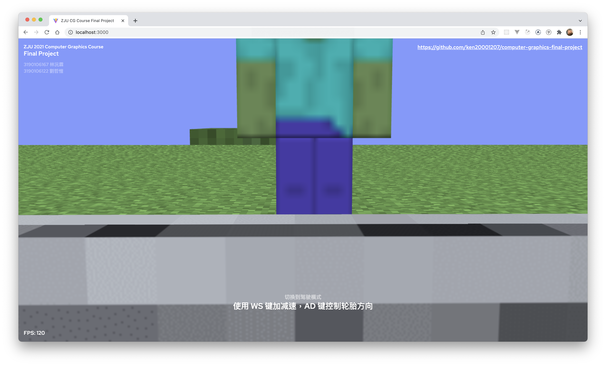
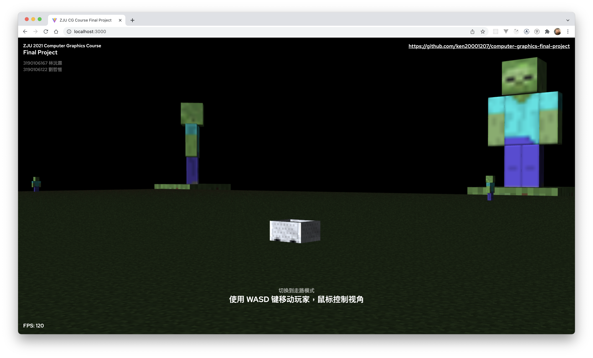
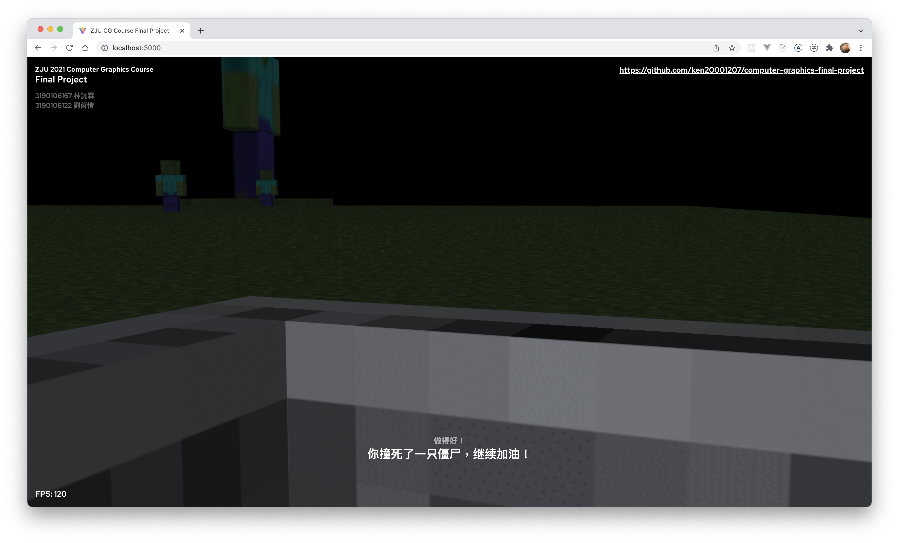
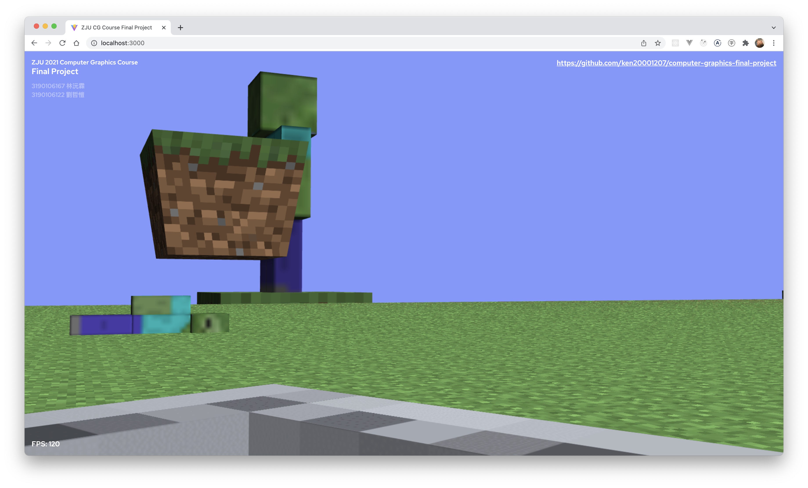

# computer-graphics-final-project

浙江大学 2021 秋冬学期《计算机图形学》课程期末大作业，一款基于 WebGL 的 Minecraft 风格赛车游戏。

游戏目标是尽可能的开车撞死僵尸，撞死越多分数越高，但要小心如果车掉出地图或是被僵尸巨人抛出的泥土块击中，则游戏结束。

Zhejiang University 2021 Fall-Winter course "Computer Graphics" final project, a Minecraft style car game based on
WebGL.

Try your best to kill the zombies with car, but watch out the big grass blocks thrown by giant zombie.

## Getting Start

```
# install dependencies
yarn install

# Start development in local server
yarn dev 
```

## Build

```bash
yarn build

# Output folder is `dist`
```

## How to play

In walking mode, `WSAD` for move and `space` to fly up, `x` to fly down.

When you close enough to the car, press `f` to drive it.

In driving mode, `W` to speed up, `S` to brake or back the car.

Press `A` and `D` to turn the wheel direction.

Press `N` to switch time between day and night.

Press `C` to take a screenshot.

## Screenshots






